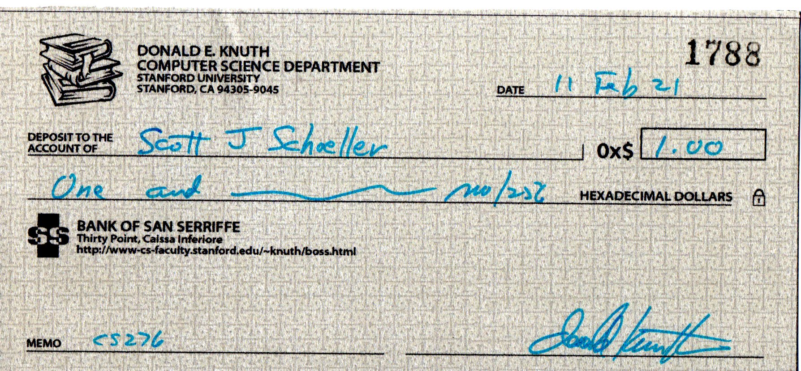

<body>
 
<h2>About Me...</h2>

I am well-rounded in scientific subjects, especially biology, chemistry and environmental studies, and last but not least, computer science!
I have been <a href="pubs.html">co-published</a> three times in the field of protein biochemistry and completed a bioinformatics thesis.
My favorite accomplishments (thus far!) surround earning three <a href="https://en.wikipedia.org/wiki/Knuth_reward_check">Knuth Reward Checks</a>. The corrected books were Volume 1 and Volume 1 Fascicle 1 of <i><a href="https://www-cs-faculty.stanford.edu/~knuth/taocp.html">The Art of Computer Programming</a></i>, <i><a href="https://www-cs-faculty.stanford.edu/~knuth/da.html">Selected Papers on Design of Algorithms</a></i>, as well as <i><a href="https://www-cs-faculty.stanford.edu/~knuth/cs.html">Selected Papers on Computer Science</a></i>.

&nbsp;&nbsp;
 

Additional achievements include membership in <a href="https://www.phikappaphi.org/">The Honor Society of Phi Kappa Phi</a> and various scholarships.
 

<h3>Education</h3>
Master of Science, Computer Science, UW-Whitewater, May 2021 
Minor, Computer Science, UW-Whitewater, May 2018 
Bachelor of Science, Chemistry, UW-Whitewater, Dec 2014 

 
<h3>For More Information...</h3> 
<a href="https://drive.google.com/file/d/1NDO06h8JYRQKnt1zMERhviXTVNw9Fc1R/preview" width="640" height="480">My Background</a> (slideshow) 
<a href="https://drive.google.com/file/d/1dVYJeVKu_Lk_8vBKNLqGndjs38MPg8-c/view?usp=sharing">My Internet Resume</a> 
<a href="knuthkorner.html">My Library</a> 
 <a href="hobbies.html">Hobbies</a> 
<a href="favlinks.html">Favorite Links</a> 
 
<h2>Other Web Presence...</h2>
<a href="https://www.linkedin.com/in/sschoellerSTEM">My LinkedIn Profile</a> 
<a href="https://sschoellerSTEM.blogspot.com">My Blog</a> 
<a href="https://www.goodreads.com/sschoellerstem">My Goodreads Profile</a> 
<a href="https://twitter.com/sschoellerSTEM">My Twitter Profile</a> 
<a rel="me" href="https://noc.social/@sschoellerSTEM">My Mastodon Profile</a> 
 
<form action="https://github.com/sschoellerSTEM">
<button type="submit" style="background-color:#0000ff;color:whitesmoke">&lt;-GitHub</button>
</form>
</body>
